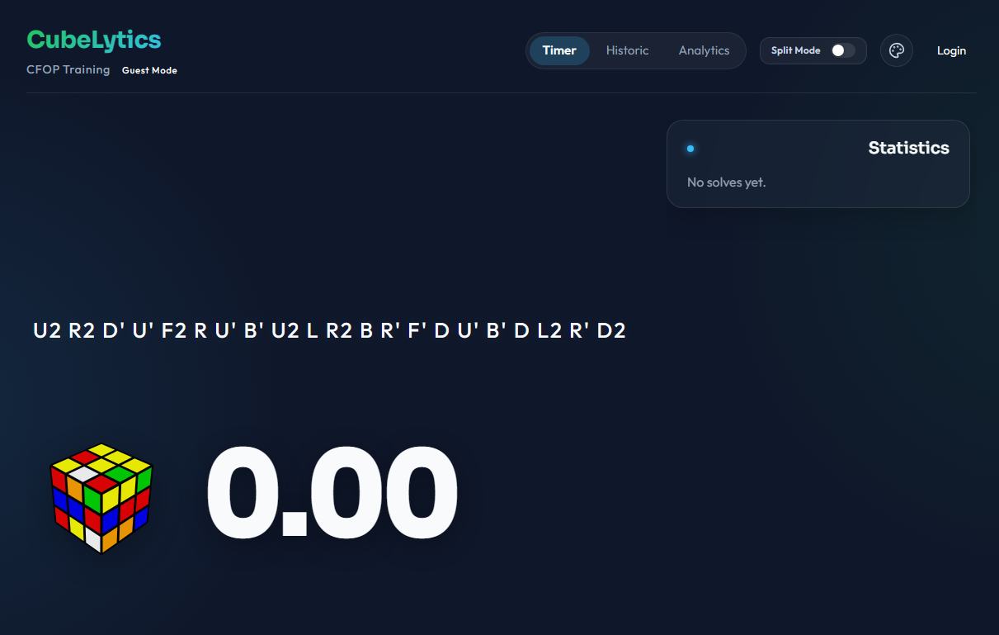
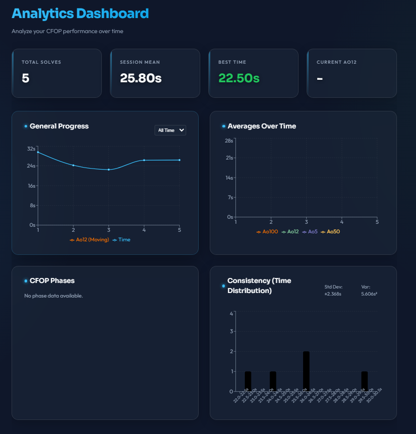
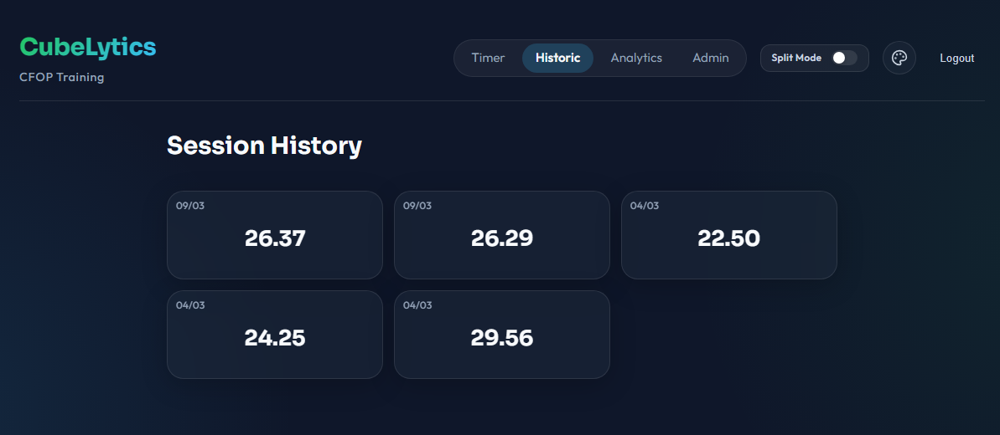

# CubeLytics

CubeLytics es una aplicación web profesional orientada al _speedcubing_, diseñada específicamente para el entrenamiento del método CFOP con la capacidad de registrar splits manuales por fase (Cross, F2L, OLL, PLL).



Este proyecto está construido con un enfoque full-stack que incluye un frontend moderno e interactivo y un backend robusto apoyado por una base de datos relacional para el registro histórico y estadísticas, todo fácilmente desplegable mediante Docker.

## Características Principales

- **Cronómetro Avanzado**: Incluye soporte para tiempo de inspección (15 segundos WCA) y registro de penalizaciones (+2, DNF).
- **Generador de Scrambles WCA**: Generación de mezclas aleatorias que cumplen con la normativa de la World Cube Association.
- **Entrenamiento Analítico (Splits CFOP)**: Sistema innovador para medir el tiempo de cada fase del método CFOP manualmente.
- **Estadísticas Detalladas**: Cálculo de promedios locales como Ao5, Ao12 y visualización de gráficos de progreso para observar tu mejora en el tiempo.

  

- **Historial Editable**: Registro de todos los tiempos ("cube assemblies") realizados, donde puedes revisar, editar o eliminar resoluciones previas.

  

- **Despliegue Sencillo**: Todo el entorno está contenedorizado para poder levantarse con un solo comando.

## Tecnologías Utilizadas

### Frontend

- **React + TypeScript**: Desarrollo basado en componentes con tipado estático para mayor fiabilidad.
- **Vite**: Herramienta de compilación ultrarrápida.
- **Zustand**: Gestión del estado global, simple y eficiente (ideal para el estado reactivo del cronómetro).

### Backend

- **Java 21 + Spring Boot**: API REST robusta y de alto rendimiento.
- **PostgreSQL**: Base de datos relacional sólida para almacenar usuarios, tiempos, historiales y configuraciones de forma persistente.

### Infraestructura

- **Docker & Docker Compose**: Orquestación y contenedorización de todos los servicios (frontend, backend, y base de datos) para un desarrollo y despliegue rápido.

## Requisitos Previos

- Tener [Docker](https://docs.docker.com/get-docker/) y [Docker Compose](https://docs.docker.com/compose/install/) instalados en tu sistema.
- Puerto 3000 (Frontend), 8080 (Backend) y 5432 (PostgreSQL) disponibles en tu máquina anfitriona.

## Cómo ejecutar el proyecto

Para iniciar la aplicación, asegúrate de estar situado en la raíz del proyecto (donde se encuentra este archivo y el `docker-compose.yml`) y ejecuta el siguiente comando:

```bash
docker compose up --build
```

Este comando se encargará de:

1. Construir las imágenes de Docker para el **Frontend** y el **Backend**.
2. Descargar y levantar un contenedor de **PostgreSQL**.
3. Configurar la comunicación en red entre todos los servicios integrados.

Una vez que los servicios estén activos:

- **Frontend / Aplicación Web**: Abre tu navegador y dirígete a `http://localhost:3000`
- **Backend / API**: Disponible en `http://localhost:8080`

Para detener la ejecución del proyecto y los contenedores, puedes usar:

```bash
docker compose down
```

## Estructura del Proyecto

```text
rubik/
├── docker-compose.yml    # Configuración de los servicios Docker
├── frontend/             # Código fuente de React (Vite, Zustand, Tailwind etc.)
└── backend/              # Código fuente de la API en Java/Spring Boot
```
